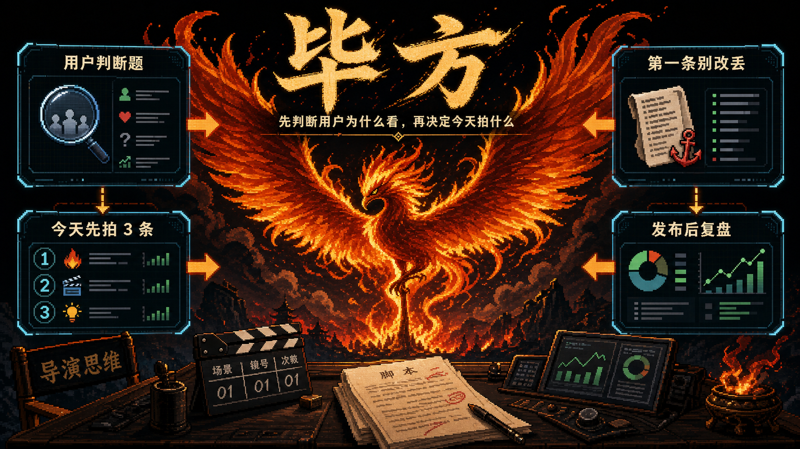

# 毕方 V0.2-rc



毕方是一组可迁移的商业短视频编导 skills。

它不是账号管理 SaaS，也不是单纯的文案生成器。它的核心价值是：先帮助使用者判断用户为什么会看、该先拍什么、为什么先拍，再进入选题、脚本、审核、改稿和复盘。

适合两类人使用：

- 短视频编导、代运营、内容顾问：用来帮助客户梳理用户视角，解释为什么不能把脚本改回卖点介绍。
- 商家、老师、主理人、销售、手艺人：围绕自己的产品、服务、课程、门店、项目或专业经验辅助创作。

## V0.2-rc 目标

V0.2-rc 是正式候选版。当前目标是把 V0.1 的“能用”打磨成“不同人第一次用也不跑偏”。

这一版重点解决三件事：

1. 先教客户知道要拍什么，而不是直接给拍剪建议。
2. 把行业、产品和卖点翻译成用户正在判断的问题。
3. 用跨行业压测减少模板化、瞎编证据、默认写脚本和高风险承诺。

默认输出必须优先回答：

```text
用户真正想看什么？
今天先拍哪 3 条？
第一条内容改稿时不能丢什么？
```

## 安装

把需要的 skill 文件夹复制到你的 Agent skill 目录。

Codex 默认目录通常是：

```text
C:\Users\你的用户名\.codex\skills
```

推荐先安装核心模块：

```text
bifang-starter
bifang-topic
bifang-script
bifang-review
bifang-rewrite
bifang-feedback
```

如果需要完整客户建档和交付报告，再安装：

```text
bifang-intake
bifang-diagnosis
bifang-profile
bifang-assets
bifang-report
```

## 第一句怎么问

优先使用 `bifang-starter`。

最少输入：

```text
我是【自己做内容/帮客户做内容】。
我做【行业/账号/项目】，主要推广【产品/服务/课程/门店/项目/专业经验/内容 IP】。
目标用户是【谁会看/谁会买/谁会咨询】。
我想通过短视频实现【私信/到店/成交/涨粉/建信任/收线索/招生/下单】。
我目前有的证据是【案例/过程/资质/用户反馈/现场素材】。
```

也可以只给一句话：

```text
我开社区面馆，想拍抖音引流。
```

信息少时，毕方会先基于默认假设跑一版，并标注哪些地方需要补充。

## 默认输出

`bifang-starter` 默认只输出三块：

```text
1. 你的用户真正想看的
2. 今天先拍这 3 条
3. 第一条别改丢
```

第一块必须把行业翻译成用户判断题：

```text
用户正在判断什么，而不是你想介绍什么。
```

## 模块说明

- `bifang-starter`：极简入口，先判断该拍什么。
- `bifang-topic`：根据用户判断题生成批量选题。
- `bifang-script`：写完整脚本，保留判断标准、信任证据和承接动作。
- `bifang-review`：审核脚本，只判断不改稿。
- `bifang-rewrite`：改稿，防止改丢用户问题、判断标准和成交理由。
- `bifang-feedback`：发布后复盘，根据数据反推下一条拍什么。
- `bifang-intake`：客户需求采集。
- `bifang-diagnosis`：完整商业诊断。
- `bifang-profile`：账号画像和内容策略建档。
- `bifang-assets`：行业素材沉淀。
- `bifang-report`：组装客户交付报告。
- `bifang-baokuan` / `bifang-baokuan-batch`：历史兼容入口，新用户优先使用 `bifang-starter`。

## 使用原则

1. 先判断用户为什么看，再判断商家怎么卖。
2. 先讲判断方法，再给内容结果。
3. 缺证据不能编案例、编数据、编资质。
4. 默认不输出长报告、评分表、完整脚本库和拍剪清单。
5. 高风险行业优先讲判断标准、流程透明、适用边界和下一步专业确认。
6. 多账号运营时，建议一个账号一个窗口或一个文件夹，避免上下文混乱。

## 开源版边界

开源版只包含通用编导判断框架和通用测试样例。

不包含：

- 私有达人/竞品研究资料。
- 私有客户案例和发布数据。
- 内部商业化、报价、试跑材料。
- 尚未清理的复杂编排器和销售工具。

你可以把自己的行业资料、客户数据、发布数据作为私有知识库接入，但不要把未授权课程内容、达人私有材料或客户数据写进公开版本。

## 验收

主要检查：

```text
tests/smoke_cases.md
tests/director_thinking_pressure_tests.md
tests/v0.2_pressure_matrix.md
tests/failure_regression_cases.md
tests/open_source_acceptance.md
```

重点看：

- 是否先讲用户真正想看的。
- 是否把行业翻译成用户判断题。
- 是否给今天先拍 3 条，并说明为什么先拍。
- 是否给第一条别改丢的改稿锚点。
- 是否没有默认展开完整脚本和拍剪建议。
- 是否没有虚构证据、案例、数据、资质。
- 是否在高风险行业避免绝对承诺。

V0.2-rc 已完成的内部验收摘要：

```text
真实公开账号低信息压测：40/40 通过
老账号 9 条内容复盘：3/3 通过
客户改稿纠偏：3/3 通过
高风险完整脚本审核：5/5 通过
完整交付链路压测：2/2 通过
```

开源版只保留通用方法和干净测试样例；内部压测明细、私有研究和客户资料不进入开源包。

## 许可

见 `LICENSE`。

## 交流与反馈

如果你正在测试毕方，欢迎反馈使用问题、行业样本和改进建议。


